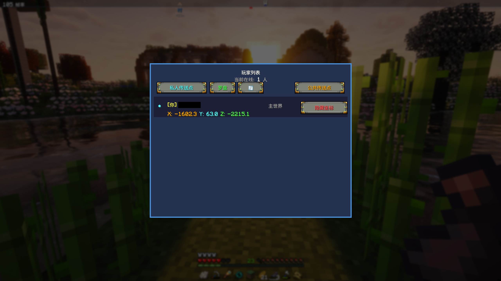

# 玩家互传 (PlayerTP)


> 世界那么大,一键去看看。🌍
> The world is big. One key to go anywhere. 🌍

一个为 Minecraft Forge 1.20.1 打造的玩家互传模组:玩家间一键传送、私人/公共传送点、死亡点记录、罗盘导航 HUD。
A player teleportation mod for Minecraft Forge 1.20.1: one-click teleport to players, personal & public waypoints, death point records, and an in-world compass HUD.

---

## ✨ 功能 / Features

| 中文 | English |
|---|---|
| 🧍 玩家互传:打开玩家列表,一键传送到任意在线玩家 | 🧍 Teleport to any online player with one click |
| 📍 私人传送点:添加、编辑、删除、分享、排序 | 📍 Personal waypoints: add, edit, delete, share, reorder |
| 🌐 公共传送点:全服共享,人人可用 | 🌐 Public waypoints shared across the whole server |
| 💀 死亡点记录:死亡自动记点,装备不再丢 | 💀 Death point auto-recorded on death |
| 🧭 罗盘 HUD:屏上方向信标,个人点蓝、公共点橙 | 🧭 Compass HUD: blue personal / orange public beacons |
| ⚡ 快捷传送:标记一个点,按 ↓ 一键直达 | ⚡ Quick teleport: mark a point, press ↓ to return |
| 🕐 传送历史:每人保留最近 10 条记录 | 🕐 Teleport history: last 10 destinations per player |
| 🙈 隐身模式:从玩家列表隐藏自己的坐标 | 🙈 Hide your coordinates from the player list |
| ⭐ 经验值消耗:可配置开关与数量(默认关闭) | ⭐ Optional experience cost for teleports (off by default) |
| 🌍 中英双语,跟随客户端语言自动切换 | 🌍 Fully localized: 中文 / English |

## 🎮 快捷键 / Key Bindings

| 按键 Key | 功能 Function |
|---|---|
| `=` | 打开玩家列表 / Open player list |
| `-` | 快速添加当前位置为传送点 / Quick-add current position |
| `↓` | 传送到标记的快捷传送点 / Teleport to marked quick point |

私人 / 公共传送点界面通过界面内的导航按钮打开。
Personal and public points screens are opened via the in-screen nav buttons.

按键均可在 设置 → 控制 → 按键绑定 中修改。
All keys can be rebound in Settings → Controls → Key Binds.

## 📥 安装 / Installation

- 需要 Minecraft **1.20.1** + Forge **47.x**
- **客户端和服务端都需要安装本模组**(两边都有逻辑,不是纯客户端 mod)
- 将 `playertp-1.0.0.jar` 放入 `.minecraft/mods`(服务端放入 `mods/`)即可

Requires Minecraft 1.20.1 with Forge 47.x. Install the JAR on **both client and server** — this mod has logic on both sides.

## 🔧 构建 / Build

```bash
./gradlew build
```

产物位于 `build/libs/playertp-1.0.0.jar`。需要 JDK 17。
The output JAR is at `build/libs/playertp-1.0.0.jar`. JDK 17 required.

## 🖼️ 截图 / Screenshots




## 📥 下载 / Download

- [Modrinth](https://modrinth.com/mod/playertp)
- [CurseForge](https://www.curseforge.com/minecraft/mc-mods/playertp/preview)

## 📜 许可证 / License

本项目采用 [MIT License](LICENSE) 开源。© 2026 MOOU
Released under the [MIT License](LICENSE). © 2026 MOOU
